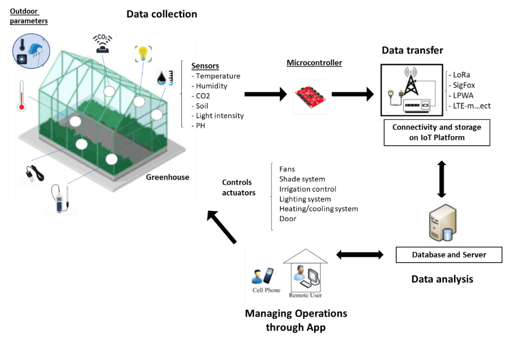

#  Smart Greenhouse Automation using Industry 4.0 

In recent decades, climate change and a shortage of resources have brought about the need for technology in agriculture. Farmers have been forced to use information and innovation in communication in order to enhance production efficiency and crop resilience. Systems engineering and information infrastructure based on the Internet of Things (IoT) are the main novel approaches that have generated growing interest. In agriculture, IoT solutions according to the challenges for Industry 4.0 can be applied to greenhouses. Greenhouses are protected environments in which best plant growth can be achieved. IoT for smart greenhouses relates to sensors, devices, and information and communication infrastructure for real-time monitoring and data collection and processing, in order to efficiently control indoor parameters such as exposure to light, ventilation, humidity, temperature, and carbon dioxide level. 

This solution shows the current state of the art in the IoT-based application to smart greenhouse, underlining benefits and opportunities of this technology in the agriculture environment.

IoT(Internet Of Things) is a technological revolution that has mobilized industry. It brings about new opportunities and challenges in several economic fields. IoT is an exciting technology that opens many possibilities for greenhouse cultivation. Moreover, it can be applied to various technical solutions that identify objects, as well as capturing, storing, processing, and transferring data in physical environments and in between physical and virtual worlds.
IoT supports the transition from the traditional greenhouse to smart solutions, which consists of an intelligent greenhouse equipped to track the indoor parameters and to communicate with the farmer who can make decisions automatically to preserve crops and improve production.
IoT for smart greenhouses includes a wide variety of devices integrated with sensors and actuators, which are connected to and interact with each other via the internet, trending toward a greater osmosis between the real world and digital world. Sensors and actuators, which are the key elements of the IoT, monitor the state of the system as well as the environmental parameters, obtaining information on temperature, humidity, CO2, water and energy consumption, movement, position, etc., and which manage the dynamics of the system.
Moreover, the possibility of controlling the above-mentioned indoor values within certain reference levels minimizes pesticide treatments for the prevention of the main diseases to which the crops are subjected. The possibility of monitoring and controlling the optimal conditions of crops in a protected environment minimizes the damage due to climate change or to any weather condition, as well as allows the farmer to intervene by irrigating, heating, and fertilizing only to the extent that is necessary to achieve the pre-established objectives, effectively avoiding waste and implementing water and energy-saving approaches.
In conclusion, mainly for its characteristics of accurate measurements everywhere, anytime, and at a reasonable cost, it can be said that the introduction of IoT and related technologies in greenhouse systems may allow for the development of a new developing economy in agriculture, above all, in specific territories, such as the ones present in the western part of the Liguria region in Italy, which has been excellent for many years in flower production, but which has also been in a deep crisis for the last few years.
